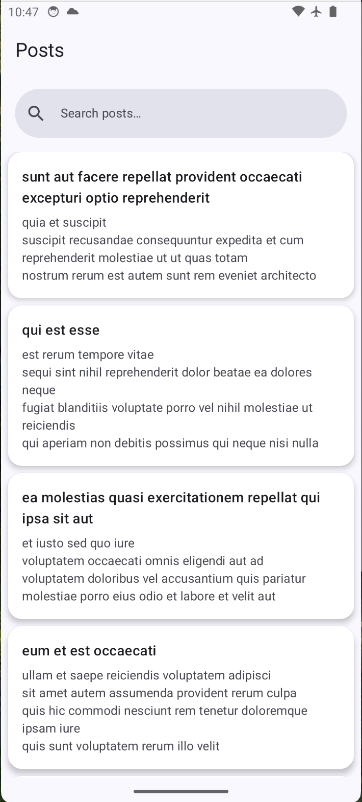
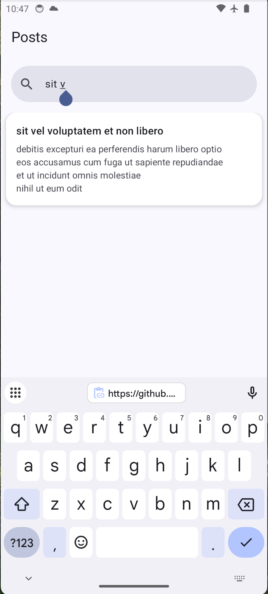
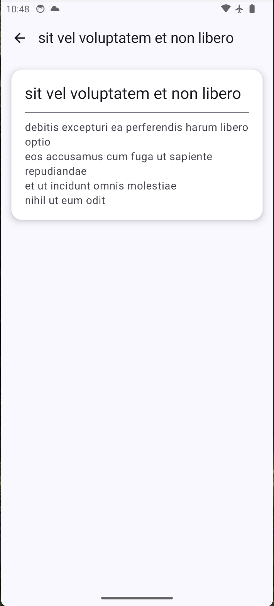

# 📱 Posts Viewer App

A **modern Android app** built with **Kotlin**, **Jetpack Compose**, **Hilt**, **Retrofit**, and **Room** to fetch and display posts from a public API. Designed with clean architecture, offline caching, and a sleek UI/UX, perfect for interview demos.

---

## ✨ Features

- Fetch posts from [JSONPlaceholder API](https://jsonplaceholder.typicode.com/posts)
- Beautiful, scrollable **list of posts** with Material Design cards
- Tap to view **post details** in a clean, readable layout
- **Pull-to-refresh** functionality
- **Search** posts by title in real-time
- **Offline caching** with Room database
- Loading indicators & error handling with snackbars
- **Hilt DI** for dependency injection
- State management with **ViewModel + StateFlow**

---

## 🖼 Screenshots

<p float="left">


</p>

<p float="left">

</p>

---

## 🏛 Architecture

- **MVVM** architecture with **StateFlow** for reactive UI updates
- **Domain Layer**: `Post` model + `PostsRepository` interface
- **Data Layer**: Retrofit DTOs, Room Entities, Repository Implementation
- **Presentation Layer**: Compose UI observing domain models

---

## 🧩 Libraries Used

| Library | Purpose |
|---------|---------|
| Kotlin + Coroutines | Asynchronous programming |
| Jetpack Compose (Material3) | Modern UI toolkit |
| Navigation Compose | Navigation between screens |
| Hilt | Dependency Injection |
| Retrofit + Gson | Network API calls |
| OkHttp Logging | Network debugging |
| Room + KTX | Local caching & offline support |
| Accompanist SwipeRefresh | Pull-to-refresh UI |

---

## 🚀 How to Run

1. Clone the repository:
```bash
git clone https://github.com/zfml/PostsViewerApp.git
```
2. Open the project in **Android Studio**
3. Sync Gradle to download dependencies
4. Run the app on an emulator or physical device

---

## 📂 Folder Structure

```
com.example.postsviewer
├── data
│ ├── local # Room entities and DAOs
│ ├── remote # Retrofit API interfaces & DTOs
│ ├── Mappers.kt # Entity/DTO <-> Domain mapping
│ └── PostsRepositoryImpl.kt
├── domain
│ ├── Post.kt # Domain model
│ └── PostsRepository.kt # Domain repository interface
├── ui
│ ├── PostListViewModel.kt
│ ├── PostDetailViewModel.kt
│ └── screens # Compose UI screens
├── di # Hilt modules
├── MainActivity.kt
└── PostsViewerApp.kt # Application class
```

---

## 🤝 Contributing

Contributions are welcome! Feel free to fork the repository, make your changes, and submit a pull request.

---

## 📝 License

This project is licensed under the MIT License.

---

> Made with ❤️ using Kotlin & Jetpack Compose
